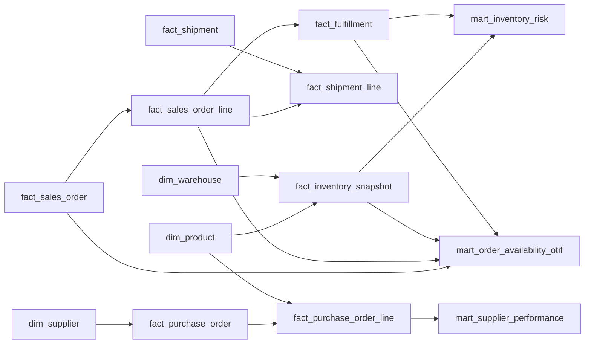

# Data Model — Project 02: Inventory & Order Fulfillment Analytics

## 1. Model Boundary

This repository begins at the **Gold Layer** and depends on cleaned Silver tables produced upstream:

https://github.com/FatBoyIL/SEPRO_Cleaning_Data

Project 02 also reuses shared commercial entities from Project 01 rather than rebuilding the same business logic from raw data.

## 2. Source-to-Gold Lineage

```text
Synthetic Operational Sources
        ↓
Bronze
        ↓
Silver
        ↓
Shared Dimensions / Sales Order Facts
        +
Inventory / Purchasing / Shipment Facts
        ↓
Operational Analytical Marts
        ↓
SQL Analysis / Power BI
```

## 3. Main Source-Domain Inputs

| Source domain | Main role |
|---|---|
| `inventory_daily_snapshot_raw.csv` | Daily product × warehouse inventory position |
| `inventory_movements_raw.csv` | Inventory transaction history |
| `inventory_policy_history.csv` | Reorder point, safety stock, holding-rate assumptions |
| `purchase_orders_raw.csv` | PO header, supplier and expected receipt dates |
| `purchase_order_lines_raw.csv` | Purchased product, quantity, price and inbound costs |
| `qa_events_raw.csv` | Supplier/product quality events and estimated quality cost |
| `shipments_raw.csv` | Shipment header and actual delivery date |
| `shipment_lines_raw.csv` | Partial shipment quantities by Sales Order Line |
| `sales_orders_raw.csv` | Requested delivery date and order-level customer promise |
| `sales_order_lines_raw.csv` | Product demand and ordered quantity |
| Shared product/supplier/warehouse/customer/FX data | Dimensional and conversion context |

## 4. Reused Shared Model

Project 02 assumes the following shared concepts are already available from the portfolio model:

- Date
- Customer
- Product
- Supplier
- Warehouse
- Sales Order
- Sales Order Line

The repo may contain local references or documentation for these dependencies, but should not duplicate their upstream cleaning logic.

## 5. Project 02 Facts

| Gold object | Grain | Main analytical use |
|---|---|---|
| `gold.fact_inventory_snapshot` | Date × Product × Warehouse | Stockout, available inventory, backlog, inventory value |
| `gold.fact_inventory_movement` | 1 inventory movement | Explain inventory inflow/outflow and adjustments |
| `gold.fact_purchase_order` | 1 purchase order | Supplier, PO date, expected/actual receipt context |
| `gold.fact_purchase_order_line` | 1 PO line | Purchased quantity, product and cost components |
| `gold.fact_shipment` | 1 shipment | Ship/delivery event and logistics context |
| `gold.fact_shipment_line` | 1 shipment line | Quantity shipped against an order line |
| `gold.fact_fulfillment` | 1 Sales Order Line fulfillment record | Ordered vs shipped quantity and line completion/timeliness |

## 6. Analytical Marts

### `gold.mart_inventory_risk`

**Grain:** month × product.

Main outputs include:

- average available quantity;
- stockout SKU-warehouse-days;
- observed SKU-warehouse-days;
- weighted stockout rate;
- trailing 60-day average daily demand;
- inventory coverage days;
- fulfillment-risk measures;
- average network inventory value.

Warehouse-specific risk remains available through `fact_inventory_snapshot` for Product × Warehouse × Month diagnostics.

### `gold.mart_order_availability_otif`

**Grain:** 1 row = 1 Sales Order.

The mart aggregates partial shipment evidence before deciding whether the order was delivered **On Time and In Full**.

Important attributes include:

- requested delivery date;
- delivered flag;
- final delivery date;
- complete flag;
- OTIF flag;
- availability group;
- days late.

### `gold.mart_supplier_performance`

**Grain:** 1 row = 1 Purchase Order Line.

The mart combines purchasing, receipt timing, inbound cost, QA impact, inventory holding assumptions, and estimated TCO components.

## 7. Relationship Logic



## 8. Grain Controls

Project 02 has several different grains and should not flatten them blindly:

- Inventory snapshot = day × product × warehouse.
- Sales Order Line = order-line demand.
- Shipment Line = partial shipment event/line quantity.
- Customer OTIF = Sales Order.
- Supplier performance = PO line.

A common error is joining order lines to multiple shipment lines and then summing ordered quantity again. Fulfillment and OTIF calculations therefore aggregate shipment evidence before order-level KPIs are produced.

## 9. Availability-at-Order Logic

The Gold analysis groups order-line availability as:

- `Available in full`
- `Partially available`
- `No stock`
- `Missing snapshot` when required inventory evidence is absent

Because the source model does not provide a confirmed allocated warehouse for every Sales Order Line, the project uses a **network-level availability view** across warehouses for the main availability-vs-OTIF analysis.

## 10. Supplier Cost Model

Supplier analysis expands beyond purchase price:

```text
Merchandise Cost
+ Freight
+ Customs
+ Expedite
+ Quality Cost
= Landed Cost

Landed Cost
+ Estimated Holding Cost
= Estimated TCO
```

Estimated holding cost uses inventory value, a carrying-rate assumption, and a time component. It is a decision-support proxy rather than a booked accounting cost.

## 11. Power BI Modeling Note

Use the three analytical marts as the main reporting tables. Fact tables should remain available for drill-through and diagnostic pages rather than recreating transaction-level joins inside Power BI.
